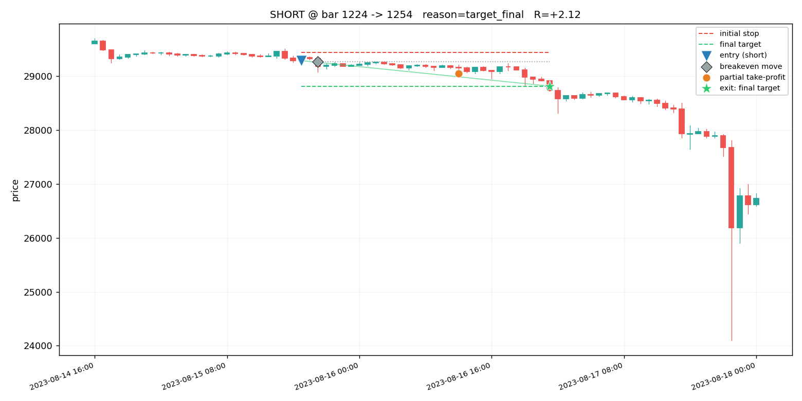

# backtester — an honest, no-lookahead event-driven backtest framework

A small Python framework for backtesting price-based trading strategies on OHLCV
(candlestick) data. It focuses on the thing most backtests get wrong: **realism**.
No lookahead, honest fill assumptions, explicit costs, and tools to check whether
a result is stable rather than curve-fit.

> **This repo contains the backtest _engine_ only — no trading strategy.**
> The included `DonchianBreakout` and `MACross` are generic textbook examples,
> shipped only so the framework runs out of the box. Bring your own strategy.

---

## Why another backtester?

Most home-grown backtests quietly lie in a few predictable ways: they peek at
future bars, they assume every take-profit fills for free, they let breakeven
stops lock in gains that never happened, and they ignore fees, slippage, and
funding. Each of these inflates results, and together they can turn a losing
system into a "winner" on paper.

This framework was extracted from a live crypto trading bot after roughly two
weeks of hardening specifically aimed at removing those lies. The exit engine is
the validated core.

## Features

- **No-lookahead by construction.** A signal decided at bar `i` is only ever
  filled at bar `i+1` or later, and the exit simulator only scans forward.
- **Honest fill model** (`backtester/exits.py`):
  - Stops fill at the stop price and pay **taker fee + slippage** (you cross the
    book when stopped out).
  - Take-profits fill at the target and pay the **maker fee** (resting limit).
    A `tp_taker=True` switch models the pessimistic case where the resting TP is
    assumed to miss and you exit at market instead — an EV lower bound.
  - **Breakeven stops are capped at the trigger price.** You can never lock in
    more than the move that actually happened on the trigger bar. (Skipping this
    cap is a classic way fast simulators over-count breakeven winners.)
  - **Intrabar-honest breakeven (`be_intrabar="honest"`, default).** OHLC cannot
    reveal the tick path inside the bar that triggers a breakeven move, and the
    optimistic convention (trigger bar assumed "held"; a same-bar target booked
    as a clean TP) systematically flatters tight locks — in live trading this
    exact bias produced a 69% vs 32% breakeven-exit-rate divergence (4.7 sigma)
    before it was caught. Honest rule: if the trigger bar **closes** beyond the
    moved stop, the trade is stopped on that bar; a same-bar target only counts
    when the close held the lock. Set `be_intrabar="optimistic"` to A/B the
    legacy behaviour.
  - **Funding** charged per 8h window held (perp-style).
  - Within one bar the touch order is unknown from OHLC, so ties are resolved
    **pessimistically** (stop assumed before target).
- **Pending orders occupy the account (`pending_occupy=True`, default).** A
  resting limit that never fills still blocked the (serial) account until it
  expired — exactly like a live bot. Disabling this systematically overrates
  long entry windows in sweeps.
- **R-based accounting.** Everything is measured in R (multiples of the fixed
  risk per trade), which is account-size independent and comparable across assets.
- **A pre-trade risk guard** that rejects absurd position sizes (unit mix-ups,
  abnormally tight stops).
- **Cost stress test** via `cost_mult` (e.g. run everything at 1.5x costs).
- **Parameter sweep and walk-forward** helpers to test *stability*, not just to
  find one flattering number.
- **Keyless data downloader** (`download_data.py`) — public klines via `ccxt`,
  no API keys.
- **Local CSV cache for fast iteration.** Data is cached on disk; repeated
  backtests read from the cache with no re-download, and `load_or_download`
  fetches a symbol only once. Updates are incremental (only new bars).
- **Chart visualization for verification** (`backtester/plot.py`). Draw every
  engine action — entry, stop/target levels, breakeven move, partial take-profit,
  final exit (coloured by reason) — on candlesticks, so you can *see* whether the
  engine is behaving.

## Install

```bash
pip install -r requirements.txt
```

Requires Python 3.9+. `ccxt` is only needed for `download_data.py`; the engine
itself needs only `pandas` and `numpy`.

## Bundled data

For convenience and reproducibility this repo ships ~3 years of historical
klines under `data/` so you can run backtests immediately without downloading
anything:

- **Assets (8):** BTC, ETH, SOL, BNB, XRP, DOGE, AVAX, LINK (USDT perpetuals)
- **Timeframes (5):** 15m, 30m, 1h, 4h, 1d
- **Span:** ~2023-06 to 2026-06
- **Source:** public exchange klines fetched with `ccxt` (see `download_data.py`)
- **Size:** ~86 MB total

Refresh or extend it any time (incremental, keyless):

```bash
python download_data.py --symbols BTC/USDT:USDT,ETH/USDT:USDT --timeframes 1h,15m
```

Klines are public market data; they are included here only to make the examples
reproducible. Re-download from your own venue if you need authoritative bars.

## Local cache (why repeated backtests are fast)

Data lives on disk as plain CSV under `data/`, and the loader reads straight from
it — so once a symbol/timeframe is cached, every backtest on it is instant with
**no network calls**. This is the difference between iterating in seconds versus
re-pulling years of klines on every run.

One call handles both cases (load from cache, or download-once-then-cache):

```python
from backtester.data import load_or_download

# First call for a new symbol downloads + caches; every later call is instant.
df = load_or_download("BTC/USDT:USDT", "1h")          # reads data/ if present

# Top up an existing cache to the latest bars (fetches only the new ones):
df = load_or_download("BTC/USDT:USDT", "1h", update=True)
```

Update or extend the whole cache from the command line (incremental, keyless):

```bash
python download_data.py --exchange binance --market-type swap \
    --symbols BTC/USDT:USDT,ETH/USDT:USDT --timeframes 1h,15m --years 3
python download_data.py --full     # force a clean full re-fetch
```

Re-running the downloader only fetches bars newer than what's already cached, so
keeping data current is cheap. The bundled `data/` is just a pre-filled cache —
delete or refresh it freely.

## Quick start

Run the bundled example (uses the included BTC 1h data by default; falls back to
a synthetic random walk if `data/` is empty):

```bash
python run_example.py                         # BTC 1h from data/
python run_example.py --data data/ETH-USDT-USDT_15m.csv
```

## Write your own strategy

A strategy does exactly one thing: look at bars and emit `Signal`s. The engine
handles fills, stops, targets, breakeven, costs, sizing, and accounting.

```python
from backtester import Strategy, Signal, BacktestConfig, run_backtest
from backtester.data import load_ohlcv

class MyStrategy(Strategy):
    name = "my_strategy"

    def generate_signals(self, df):
        close = df["close"].values
        out = []
        for i in range(50, len(df) - 1):
            # Decide using ONLY data up to bar i (no df[i+1:] !).
            if close[i] > close[i - 20]:              # your entry condition
                entry = close[i]
                stop  = entry * 0.98                   # 2% stop
                r     = entry - stop
                out.append(Signal(
                    index=i, direction="long",
                    entry=entry, stop=stop,
                    targets=[entry + 1.5 * r, entry + 3 * r],  # first (partial) + final
                    entry_mode="market",               # or "limit" to wait for a retrace
                    partial=0.5,                        # close half at the first target
                ))
        return out

df  = load_ohlcv("data/BTC-USDT-USDT_1h.csv")
cfg = BacktestConfig(risk_per_trade=10.0, be_at_r=0.5, be_offset_r=0.1)
res = run_backtest(df, MyStrategy(), cfg)
print(res["profit_factor"], res["expectancy_r"], res["per_year_r"])
```

**The one rule you must keep:** inside `generate_signals`, never use information
from bars after the one you're deciding on. The framework cannot detect that for
you — no-lookahead on the *signal* side is your responsibility. Everything after
the signal (fills and exits) is handled without lookahead by the engine.

### The `Signal` contract

| field         | meaning                                                              |
|---------------|---------------------------------------------------------------------|
| `index`       | bar the idea is decided on (uses data `<= index`)                   |
| `direction`   | `"long"` or `"short"`                                               |
| `entry`       | desired entry price                                                 |
| `stop`        | stop price (must be on the losing side of entry)                   |
| `targets`     | `[first_target, ..., final_target]`, nearest first                 |
| `entry_mode`  | `"market"` (next open) or `"limit"` (wait for a retrace to `entry`) |
| `entry_window`| bars to wait for a limit fill before the idea expires              |
| `partial`     | fraction closed at the first target (rest runs to the final)       |

## Sweeps and walk-forward

```python
from backtester.sweep import grid_sweep, walk_forward
from backtester.strategies import DonchianBreakout

# Test many parameter combinations — look at the spread, not just the top row.
results = grid_sweep(df, lambda **p: DonchianBreakout(**p),
                     {"lookback": [10, 20, 40], "atr_mult": [1.5, 2.0, 3.0]},
                     metric="per_year_r")

# Split time into folds — a real edge survives out of its best window.
for k, t0, t1, r in walk_forward(df, DonchianBreakout(), n_folds=5):
    print(k, r["profit_factor"], r["total_r"])
```

## Visualize / verify on the chart

Numbers can hide bugs; a chart usually can't. `backtester.plot` draws every
discrete action the engine took on candlesticks — entry, the stop and target
levels, any breakeven move, partial take-profit, and the final exit (coloured by
reason) — so you can eyeball whether each trade did the right thing.

```python
from backtester.plot import plot_trade, plot_run

plot_trade(df, res["_trades"][0], path="trade.png")          # zoom one trade
plot_run(df, res, start=1100, end=1400, path="overview.png") # a window overview
```

Or just run the example, which saves an overview plus a few single-trade zooms
to `charts/`:

```bash
python plot_example.py
```

A single-trade zoom (entry ▼, breakeven move ◆, partial take-profit ●, final
target exit ★, with stop/target level lines):



Legend: entry = blue triangle (▲ long / ▼ short); initial stop = red dashed;
final target = green dashed; breakeven move = grey diamond; partial TP = orange
dot; exit marker is coloured by reason (red ✕ stop, green ★ target, orange ▪
breakeven exit, grey ● time exit).

## Metrics

`run_backtest` returns a dict including: `n_trades`, `win_rate`,
`profit_factor`, `expectancy_r`, `total_r`, `avg_win_r`, `avg_loss_r`,
`max_drawdown_pct`, `max_loss_streak`, `return_pct`, `per_year_r`,
`trades_per_week`, `total_cost`, a per-exit-reason breakdown, and an R-bucket
distribution. The raw trades are under `_trades` and the equity curve under
`_curve`.

---

## How reliable is this, really?

Honestly: **more reliable than a typical naive backtest, but still a model with
assumptions.** Be clear-eyed about both sides.

### What it gets right (the strengths)

- **No lookahead.** Signals fill next bar; exits scan forward only. This removes
  the single most common source of fake alpha.
- **Fills are pessimistic, not optimistic.** Stops pay taker+slippage; same-bar
  stop/target ties resolve as stops; breakeven can't lock in phantom gains;
  there's a `tp_taker` mode for a true worst-case take-profit assumption.
- **Costs are explicit and stressable.** Fees, slippage and funding are all
  charged, and `cost_mult` lets you re-run everything at, say, 1.5x cost to see
  how much of the edge is fragile to execution quality.
- **R-based, cross-asset comparable accounting**, so results aren't distorted by
  position-size or account-size choices.
- **Built-in stability checks.** Walk-forward and sweeps make it easy to see
  whether a result is robust or a single lucky window / curve-fit.

### What it does not model (the limitations)

- **Intrabar path is unknown.** From OHLC alone we can't know whether the high or
  the low came first; the engine assumes the pessimistic order, but this is still
  an approximation, not tick truth. For very tight stops/targets relative to bar
  range, use finer timeframes or tick data if you need more precision.
- **Limit-entry fills are idealized.** A `"limit"` entry is assumed to fill if
  price merely *touches* the entry level. Real resting orders can be skipped in
  fast moves (queue position, gaps). This is *optimistic* for limit entries —
  prefer `"market"` entries, or treat limit-fill results as an upper bound.
- **No order book / partial fills / market impact / latency.** Fills are at your
  requested price (plus modeled slippage). Large size, thin books, and execution
  delay are not simulated.
- **Slippage is a flat fraction**, not volatility- or size-dependent.
- **One position at a time (serial).** The default engine holds a single position
  and skips overlapping signals — matching a single-account bot. It does not
  model portfolio margin, correlation, or concurrent exposure across symbols.
- **Costs are your assumptions.** The defaults are crypto-perp-ish; set the fees,
  slippage and funding to match *your* venue or the numbers are meaningless.
- **Garbage in, garbage out.** Results depend entirely on data quality: gaps,
  bad candles, survivorship (delisted symbols), and exchange-to-exchange
  differences all matter. The downloader gives you public klines; validate them.
- **Signal-side lookahead is on you.** The framework enforces no-lookahead for
  fills and exits, but it cannot inspect your `generate_signals` logic.

### Bottom line

If you keep signal-side discipline and set costs to match your venue, this gives
a **conservative, honest estimate** — it is built to *under*-promise rather than
over-promise. But no backtest is a guarantee: an honest in-sample result is a
necessary, not sufficient, condition. Confirm out-of-sample, forward-test on
paper, and size for the drawdowns you see here (they can be worse live).

## Disclaimer

This software is for research and educational purposes only. It is **not
financial advice**, not a recommendation to trade, and comes with no warranty.
The example strategies are illustrative and have no expected edge. Trading
leveraged instruments can lose money rapidly. You are responsible for your own
decisions.

## License

MIT — see [LICENSE](LICENSE).
